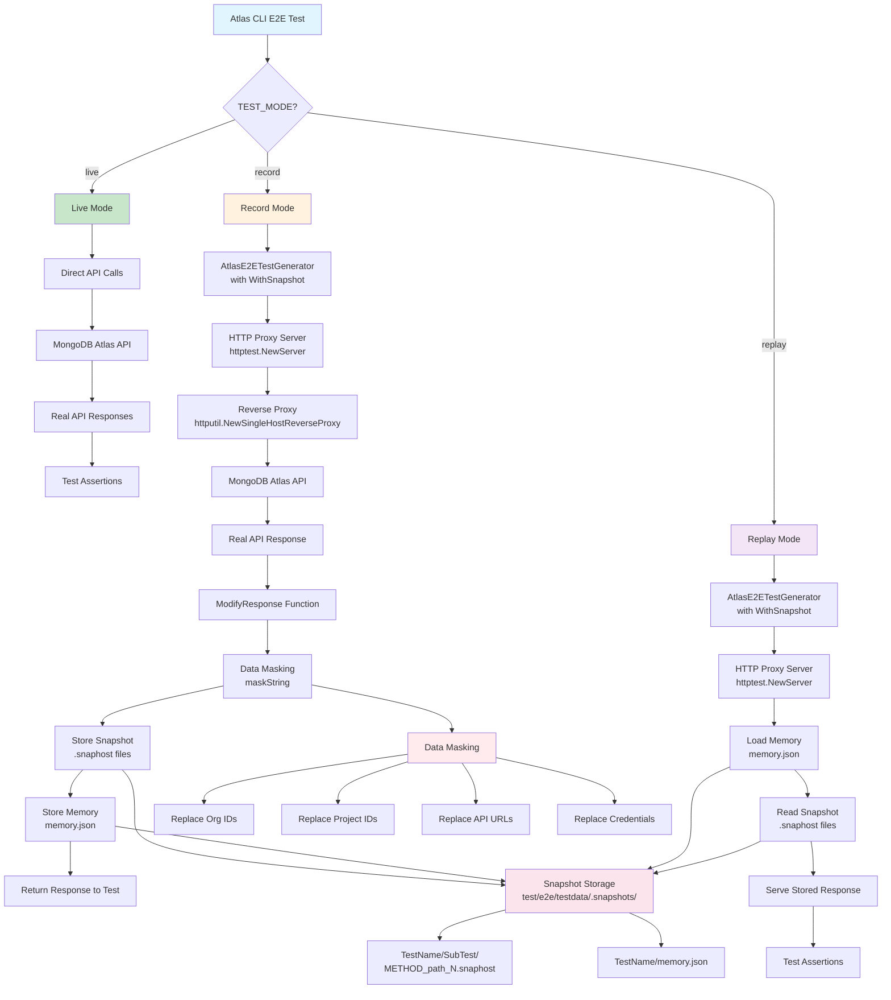
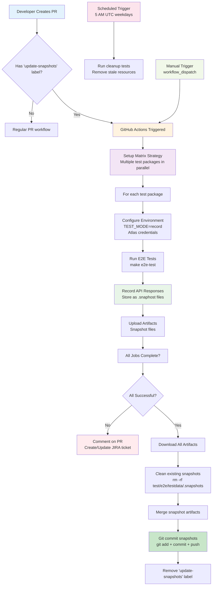
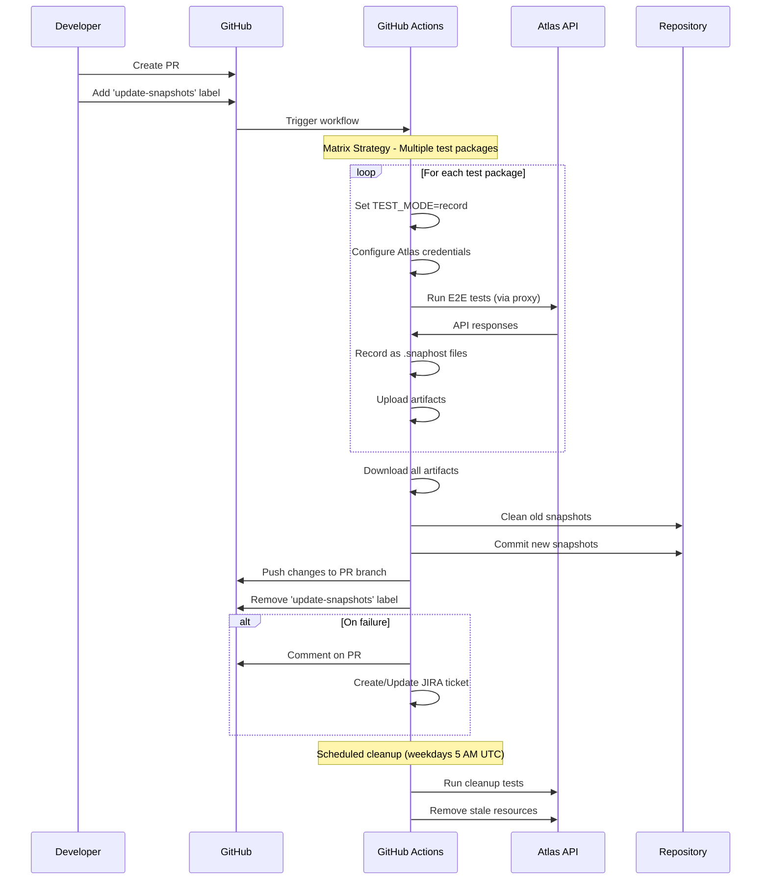

# Atlas CLI Snapshot Testing Framework Documentation

## Table of Contents

1. [Overview](#overview)
2. [Framework Architecture](#framework-architecture)
   - [Core Components](#core-components)
3. [Test Modes](#test-modes)
   - [Live Mode](#1-live-mode-test_modelive)
   - [Record Mode](#2-record-mode-test_moderecord)
   - [Replay Mode](#3-replay-mode-test_modereplay)
4. [Snapshot Storage Structure](#snapshot-storage-structure)
   - [File Organization](#file-organization)
   - [Snapshot File Format](#snapshot-file-format)
   - [Memory Persistence](#memory-persistence)
5. [Data Masking and Security](#data-masking-and-security)
6. [HTTP Proxying Implementation](#http-proxying-implementation)
7. [CI/CD Integration](#cicd-integration)
   - [GitHub Actions Workflow](#github-actions-workflow)
8. [Local Development](#local-development)
   - [Manual Snapshot Updates](#manual-snapshot-updates)
9. [Test Framework Usage](#test-framework-usage)
   - [Creating Snapshot-Enabled Tests](#creating-snapshot-enabled-tests)
   - [Memory Management](#memory-management)
   - [Advanced Configuration](#advanced-configuration)
10. [Makefile Targets](#makefile-targets)
11. [Best Practices](#best-practices)
12. [Troubleshooting](#troubleshooting)

## Overview

The Atlas CLI uses a sophisticated snapshot testing framework to enable reliable end-to-end (E2E) testing by recording and replaying HTTP interactions with MongoDB Atlas APIs. This framework allows tests to run in th ree distinct modes: live (against real APIs), record (capturing API responses), and replay (using captured responses).

### Technical Architecture Diagram



## Framework Architecture

### Core Components

1. **AtlasE2ETestGenerator** - [`test/internal/atlas_e2e_test_generator.go`](test/internal/atlas_e2e_test_generator.go)
   - Central orchestrator for snapshot-based testing
   - Manages HTTP request/response recording and replay  
   - Handles test data persistence and memory management
   - Provides utilities for cluster and project generation
   - **Key Functions**:
     - `NewAtlasE2ETestGenerator()` - Creates test generator with snapshot support
     - `snapshotServer()` - Sets up HTTP proxy for recording/replay
     - `Memory()` - Manages persistent test data

2. **Environment Configuration** - [`test/internal/env.go`](test/internal/env.go)
   - Defines test modes: `live`, `record`, `replay`
   - Manages environment-specific constants and credentials
   - Handles profile configuration for different test scenarios
   - **Key Functions**:
     - `TestRunMode()` - Determines current test execution mode
     - `ProfileName()` - Returns appropriate config profile
     - `SkipCleanup()` - Controls resource cleanup behavior

3. **HTTP Proxying Layer** - [`test/internal/atlas_e2e_test_generator.go:717-793`](test/internal/atlas_e2e_test_generator.go#L717-L793)
   - Implements a reverse proxy server using `httputil.NewSingleHostReverseProxy`
   - Intercepts HTTP calls between Atlas CLI and MongoDB Atlas APIs
   - Records responses in `record` mode, serves stored responses in `replay` mode

## Test Modes

> **Code Reference**: [`test/internal/env.go:40-63`](test/internal/env.go#L40-L63) - Test mode definitions and logic

### 1. Live Mode (`TEST_MODE=live`)
- **Purpose**: Run tests against real MongoDB Atlas APIs
- **Use Case**: Integration testing, validation of API changes
- **Code**: [`test/internal/env.go:50-51`](test/internal/env.go#L50-L51)
- **Characteristics**:
  - Direct API communication
  - No snapshot recording or replay
  - Requires valid Atlas credentials
  - Uses `__e2e` profile

### 2. Record Mode (`TEST_MODE=record`)
- **Purpose**: Capture API responses to create/update snapshots
- **Use Case**: Initial snapshot creation, updating snapshots after API changes
- **Code**: [`test/internal/env.go:54-55`](test/internal/env.go#L54-L55)
- **Characteristics**:
  - Proxy intercepts and records all HTTP responses
  - Clears existing snapshot directory before recording ([`atlas_e2e_test_generator.go:740-742`](test/internal/atlas_e2e_test_generator.go#L740-L742))
  - Masks sensitive data (IDs, credentials, URLs)
  - Stores snapshots and memory state

### 3. Replay Mode (`TEST_MODE=replay`)
- **Purpose**: Run tests using pre-recorded snapshots
- **Use Case**: Fast, reliable testing without API dependencies
- **Code**: [`test/internal/env.go:58-59`](test/internal/env.go#L58-L59)
- **Characteristics**:
  - Serves responses from stored snapshots ([`atlas_e2e_test_generator.go:770-782`](test/internal/atlas_e2e_test_generator.go#L770-L782))
  - Uses hardcoded test data from constants ([`env.go:31-37`](test/internal/env.go#L31-L37))
  - Uses `__e2e_snapshot` profile
  - No actual API calls made

## Snapshot Storage Structure

> **Storage Location**: [`test/e2e/testdata/.snapshots/`](test/e2e/testdata/.snapshots/)

### File Organization
```
test/e2e/testdata/.snapshots/
├── TestName/
│   ├── SubTestName/
│   │   ├── HTTP_METHOD_api_path_1.snaphost
│   │   ├── HTTP_METHOD_api_path_2.snaphost
│   │   └── ...
│   ├── memory.json
│   └── ...
```

**Example**: View actual snapshots in [`test/e2e/testdata/.snapshots/TestSnapshots/`](test/e2e/testdata/.snapshots/TestSnapshots/)

### Snapshot File Format
- **Extension**: `.snaphost`
- **Content**: Raw HTTP response including headers and body
- **Naming**: `{HTTP_METHOD}_{API_PATH}_{SEQUENCE_NUMBER}.snaphost`
- **Code Reference**: [`atlas_e2e_test_generator.go:496-510`](test/internal/atlas_e2e_test_generator.go#L496-L510) - Naming function

Example snapshot file content:
```
HTTP/2.0 200 OK
Content-Length: 580
Content-Type: application/vnd.atlas.2023-01-01+json;charset=utf-8
Date: Fri, 22 Aug 2025 05:16:44 GMT
...

{"copyRegions":[],"description":"test-snapshot","id":"68a7fd3cbc5dd63c21e98e89",...}
```

### Memory Persistence
- **File**: `memory.json` per test
- **Purpose**: Store test-specific data that needs to persist across test steps
- **Content**: Key-value pairs of test variables (cluster names, IDs, etc.)
- **Code**: 
  - Loading: [`atlas_e2e_test_generator.go:575-593`](test/internal/atlas_e2e_test_generator.go#L575-L593)
  - Storing: [`atlas_e2e_test_generator.go:595-611`](test/internal/atlas_e2e_test_generator.go#L595-L611)
  - Usage: [`atlas_e2e_test_generator.go:795-829`](test/internal/atlas_e2e_test_generator.go#L795-L829)

## Data Masking and Security

> **Code Reference**: [`test/internal/atlas_e2e_test_generator.go:512-529`](test/internal/atlas_e2e_test_generator.go#L512-L529) - Masking implementation

### Sensitive Data Replacement
The framework automatically masks sensitive information in snapshots:

- **Organization ID**: Replaced with `a0123456789abcdef012345a` ([`env.go:35`](test/internal/env.go#L35))
- **Project ID**: Replaced with `b0123456789abcdef012345b` ([`env.go:36`](test/internal/env.go#L36))
- **Cloud Role ID**: Replaced with `c0123456789abcdef012345c` ([`env.go:31`](test/internal/env.go#L31))
- **Identity Provider ID**: Replaced with `d0123456789abcdef012345d` ([`env.go:34`](test/internal/env.go#L34))
- **API URLs**: Replaced with `http://localhost:8080/` ([`env.go:37`](test/internal/env.go#L37))
- **Credentials**: Masked or redacted

### Configuration Profiles
```toml
[__e2e_snapshot]
org_id = 'a0123456789abcdef012345a'
project_id = 'b0123456789abcdef012345b'
public_api_key = 'ABCDEF01'
private_api_key = '12345678-abcd-ef01-2345-6789abcdef01'
ops_manager_url = 'http://localhost:8080/'
service = 'cloud'
telemetry_enabled = false
output = 'plaintext'
```

## HTTP Proxying Implementation

### Proxy Server Setup
```go
func (g *AtlasE2ETestGenerator) snapshotServer() {
    // Create reverse proxy to Atlas API
    proxy := httputil.NewSingleHostReverseProxy(targetURL)
    
    // Record mode: intercept and store responses
    proxy.ModifyResponse = func(resp *http.Response) error {
        snapshot := g.prepareSnapshot(resp)
        g.storeSnapshot(snapshot)
        return nil
    }
    
    // Test server that handles recording/replay
    server := httptest.NewServer(http.HandlerFunc(func(w http.ResponseWriter, r *http.Request) {
        if mode == TestModeRecord {
            proxy.ServeHTTP(w, r)  // Forward to real API
        } else {
            data := g.readSnapshot(r)  // Serve from snapshots
            // Write stored response
        }
    }))
}
```

### Response Processing
1. **Decompression**: Handles gzip/deflate compression
2. **Masking**: Replaces sensitive data with constants
3. **Storage**: Saves as numbered sequence files
4. **Deduplication**: Skips similar consecutive snapshots

## CI/CD Integration

### GitHub Actions Workflow
The framework integrates with GitHub Actions through [`.github/workflows/update-e2e-tests.yml`](.github/workflows/update-e2e-tests.yml):

#### CI/CD Flow Diagram



#### Sequence Diagram



#### Triggers
- **Manual**: `workflow_dispatch` ([line 4](.github/workflows/update-e2e-tests.yml#L4))
- **Scheduled**: Weekdays at 5:00 AM UTC ([line 5-6](.github/workflows/update-e2e-tests.yml#L5-L6))
- **Pull Request**: When labeled with `update-snapshots` ([line 7-8, 12](.github/workflows/update-e2e-tests.yml#L7-L8))

#### Workflow Steps
1. **Matrix Strategy**: Runs tests for multiple test packages in parallel ([line 13-63](.github/workflows/update-e2e-tests.yml#L13-L63))
2. **Test Execution**: ([line 64-151](.github/workflows/update-e2e-tests.yml#L64-L151))
   - Sets `TEST_MODE=record`
   - Configures Atlas credentials
   - Runs e2e tests with `UPDATE_SNAPSHOTS=true`
3. **Artifact Collection**: Uploads updated snapshots ([line 144-151](.github/workflows/update-e2e-tests.yml#L144-L151))
4. **Auto-commit**: Commits snapshot updates to PR branch ([line 220-253](.github/workflows/update-e2e-tests.yml#L220-L253))
5. **Cleanup**: Removes test resources ([line 152-219](.github/workflows/update-e2e-tests.yml#L152-L219))

### Environment Variables
```bash
# Core configuration
TEST_MODE=record                    # Enable recording mode
UPDATE_SNAPSHOTS=true               # Update existing snapshots
DO_NOT_TRACK=1                     # Disable telemetry

# Test execution
E2E_TIMEOUT=3h                     # Extended timeout for recording
E2E_SKIP_CLEANUP=true              # Preserve resources for recording
E2E_TEST_PACKAGES=./test/e2e/...   # Package selection
```

## Local Development

### Manual Snapshot Updates

#### Using the Update Script
**Script**: [`run-e2e-snapshots.sh`](run-e2e-snapshots.sh)
```bash
./run-e2e-snapshots.sh
```

#### Manual Process
1. **Setup Environment**:
   ```bash
   export TEST_MODE=record
   export UPDATE_SNAPSHOTS=true
   export MONGODB_ATLAS_ORG_ID="your_org_id"
   export MONGODB_ATLAS_PROJECT_ID="your_project_id"
   export MONGODB_ATLAS_PUBLIC_API_KEY="your_public_key"
   export MONGODB_ATLAS_PRIVATE_API_KEY="your_private_key"
   ```

2. **Clean Previous Snapshots**:
   ```bash
   rm -rf test/e2e/testdata/.snapshots
   ```

3. **Run Tests**:
   ```bash
   make e2e-test
   ```

### Snapshot Validation
```bash
# Run tests in replay mode to validate snapshots
TEST_MODE=replay make e2e-test-snapshots
```

## Test Framework Usage

### Creating Snapshot-Enabled Tests

**Example Tests**: See [`test/e2e/atlas/backup/snapshot/backupsnapshot/`](test/e2e/atlas/backup/snapshot/backupsnapshot/) for real examples

```go
func TestMyFeature(t *testing.T) {
    // Initialize generator with snapshot support
    g := internal.NewAtlasE2ETestGenerator(t, internal.WithSnapshot())
    
    // Use generator's Run method for subtests
    g.Run("Create Resource", func(t *testing.T) {
        // Test implementation
        cmd := exec.Command(cliPath, "resources", "create", "test")
        resp, err := internal.RunAndGetStdOut(cmd)
        require.NoError(t, err)
    })
}
```

### Memory Management
> **Code**: [`test/internal/atlas_e2e_test_generator.go:795-829`](test/internal/atlas_e2e_test_generator.go#L795-L829)

```go
// Store test data for replay consistency
clusterName := g.Memory("clusterName", internal.Must(internal.RandClusterName())).(string)

// Generate consistent random data
n := g.MemoryRand("random_number", 1000)
ip := g.MemoryRandIP("test_ip")
```

### Advanced Configuration

#### Custom Snapshot Naming
> **Code**: [`test/internal/atlas_e2e_test_generator.go:235-239`](test/internal/atlas_e2e_test_generator.go#L235-L239)

```go
g := internal.NewAtlasE2ETestGenerator(t, 
    internal.WithSnapshot(),
    internal.WithSnapshotNameFunc(internal.SnapshotHashedName),
)
```

#### Snapshot Filtering
> **Code**: [`test/internal/atlas_e2e_test_generator.go:215-233`](test/internal/atlas_e2e_test_generator.go#L215-L233)

```go
g := internal.NewAtlasE2ETestGenerator(t,
    internal.WithSnapshot(),
    internal.WithSnapshotSkip(internal.SkipSimilarSnapshots),
)
```

## Makefile Targets

> **File**: [`Makefile`](Makefile)

### Core Commands
- `make e2e-test`: Run E2E tests in current mode ([line 155-161](Makefile#L155-L161))
- `make e2e-test-snapshots`: Run tests in replay mode ([line 162-165](Makefile#L162-L165))
- `make build-debug`: Build CLI with coverage for snapshot recording ([line 150-153](Makefile#L150-L153))

### Environment Integration
The Makefile respects these environment variables ([line 25-30](Makefile#L25-L30)):
- `TEST_MODE`: Controls test execution mode ([line 30](Makefile#L30))
- `E2E_TEST_PACKAGES`: Specifies which test packages to run ([line 26](Makefile#L26))
- `E2E_TIMEOUT`: Sets test timeout duration ([line 27](Makefile#L27))
- `E2E_PARALLEL`: Controls test parallelism ([line 28](Makefile#L28))

## Best Practices

### When to Update Snapshots
1. **API Changes**: When Atlas API responses change
2. **New Features**: When adding new CLI commands or features
3. **Test Updates**: When modifying existing test logic
4. **Scheduled Maintenance**: Regular updates to catch API drift

### Snapshot Management
1. **Review Changes**: Always review snapshot diffs before committing
2. **Selective Updates**: Update only affected test packages when possible
3. **Validate Locally**: Test in replay mode before pushing changes
4. **Clean Organization**: Ensure snapshots are logically organized by test

### Security Considerations
1. **No Sensitive Data**: Verify snapshots don't contain real credentials
2. **Consistent Masking**: Ensure all sensitive data is properly masked
3. **Environment Separation**: Use dedicated test environments for recording

## Troubleshooting

### Common Issues

#### Recording Failures
- **Cause**: Missing credentials or network issues
- **Solution**: Verify environment variables and network connectivity

#### Replay Inconsistencies
- **Cause**: Outdated snapshots or test logic changes
- **Solution**: Re-record snapshots or update test logic

#### Memory Persistence Issues
- **Cause**: Inconsistent test data between recording and replay
- **Solution**: Use memory functions for all dynamic test data

### Debugging Tips
1. **Enable Debug Mode**: Build with `make build-debug`
2. **Check Logs**: Review test output for proxy and snapshot logs
3. **Compare Snapshots**: Use diff tools to compare old vs new snapshots
4. **Validate Masking**: Ensure sensitive data replacement is working

## Conclusion

The Atlas CLI snapshot testing framework provides a robust foundation for reliable E2E testing by decoupling tests from live API dependencies while maintaining realistic API interaction patterns. The combination of intelligent proxying, data masking, and automated CI/CD integration ensures that tests remain both fast and reliable while protecting sensitive information.

This framework enables:
- **Fast Test Execution**: No waiting for API calls in replay mode
- **Reliable Testing**: Consistent results independent of API availability
- **Security**: Automatic masking of sensitive data
- **Maintainability**: Automated snapshot updates through CI/CD
- **Flexibility**: Support for live, record, and replay testing modes

## Quick Reference

### Key Files
- **Framework Core**: [`test/internal/atlas_e2e_test_generator.go`](test/internal/atlas_e2e_test_generator.go)
- **Environment Config**: [`test/internal/env.go`](test/internal/env.go)
- **GitHub Workflow**: [`.github/workflows/update-e2e-tests.yml`](.github/workflows/update-e2e-tests.yml)
- **Update Script**: [`run-e2e-snapshots.sh`](run-e2e-snapshots.sh)
- **Build Config**: [`Makefile`](Makefile)
- **Snapshots Storage**: [`test/e2e/testdata/.snapshots/`](test/e2e/testdata/.snapshots/)

### Essential Commands
```bash
# Update snapshots locally
./run-e2e-snapshots.sh

# Run tests in record mode
TEST_MODE=record make e2e-test

# Run tests in replay mode  
TEST_MODE=replay make e2e-test-snapshots

# Build debug version for recording
make build-debug
```

### Environment Variables
```bash
TEST_MODE=record|replay|live    # Test execution mode
UPDATE_SNAPSHOTS=true           # Enable snapshot updates
E2E_TEST_PACKAGES=./test/e2e/... # Specific test packages
E2E_TIMEOUT=3h                  # Test timeout
```
